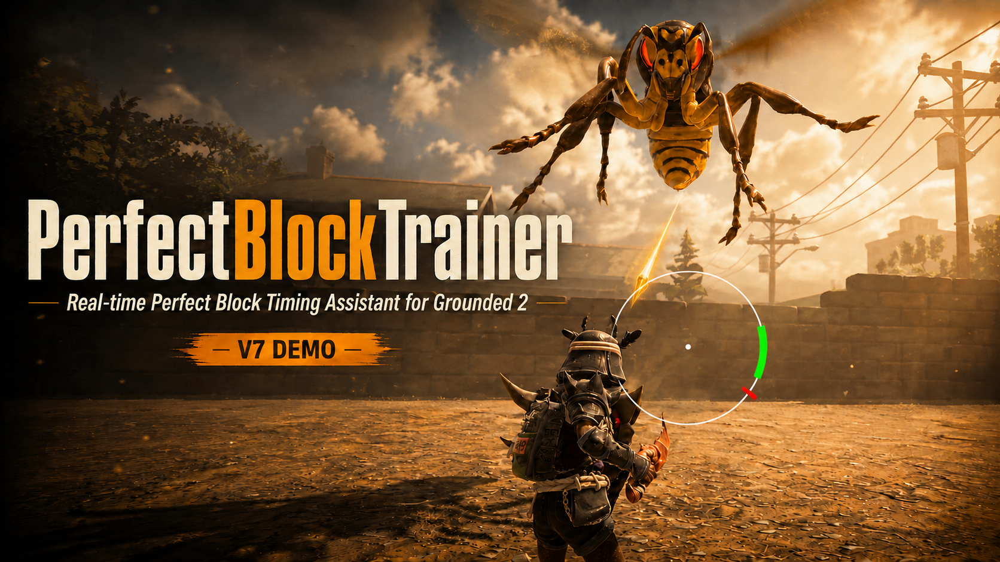

<p align="center">
  
</p>

<h1 align="center">PerfectBlockTrainer V7.0.5</h1>

<p align="center">
  <b>Real-time Perfect Block Timing Assistant for Grounded 2</b>
</p>

<p align="center">
  <a href="https://github.com/Dio23366/PerfectBlockTrainer-Releases/releases"><b>⬇ GitHub Release</b></a>
  &nbsp;•&nbsp;
  <a href="https://www.nexusmods.com/grounded2/mods/198"><b>⬇ Nexus Mods</b></a>
  &nbsp;•&nbsp;
  <a href="https://www.bilibili.com/video/BV1wh8R6iESi/"><b>▶ Gameplay Demo</b></a>
  &nbsp;•&nbsp;
  <a href="https://www.bilibili.com/video/BV1ws4R6fEYL/"><b>▶ Installation Video</b></a>
  &nbsp;•&nbsp;
  <a href="INSTALL.md"><b>Installation Guide</b></a>
</p>

---

## V7.0.5 Combat Targeting & QTE Stability Improvements / 混战目标判断与 QTE 稳定性改进

**PerfectBlockTrainer V7.0.5** improves QTE reliability during busy combat, especially when several enemies attack at the same time.

The biggest changes are easier to notice in mixed Wasp + Mosquito fights and in charge / movement attacks that end in unusual ways.

> **PerfectBlockTrainer V7.0.5** 主要提升复杂混战中的 QTE 提示稳定性，尤其是在多个敌人同时攻击时。  
>
> 这次改动在黄蜂 + 蚊子混战，以及冲刺 / 位移类攻击结束时最明显。

### V7.0.5 highlights / 本次主要更新

- More reliable QTE targeting during multi-enemy combat / 多敌人同时攻击时，QTE 目标判断更稳定
- Better Wasp + Mosquito mixed-combat handling / 改善黄蜂 + 蚊子混战时的提示稳定性
- Reduced cases where a valid QTE disappears when an enemy briefly changes target state / 减少敌人短暂改变目标状态时有效 QTE 意外消失的情况
- Reduced cases where another nearby attack incorrectly takes over the current prompt / 减少附近其他攻击错误抢占当前提示的情况
- Better QTE cleanup for charge / movement attacks / 改善冲刺与位移攻击结束后的 QTE 清理
- Fixed rare stuck or reappearing QTEs after an attack has already ended / 修复少数攻击结束后 QTE 仍卡住或再次出现的问题
- Preserved the existing projectile timing and prediction behavior / 保持现有射弹时机与预测行为
- Reduced unnecessary background checks when there is no active incoming threat / 没有有效威胁时减少不必要的后台检查

### Performance / 性能

V7.0.5 reduces some unnecessary work while no active threat exists and passed the final general performance check.

This release does **not** claim a specific FPS increase.

> V7.0.5 减少了无有效威胁时的一部分不必要后台工作，并通过最终性能检查。  
>
> 本版本不会宣称未经正式基准测试支持的具体 FPS 提升。

Compatible runtime:

- **UE4SS_Grounded2 1.0.4**
- UE4SS Git SHA: `c838a8acaade1a0f860bdf249f039e58f4e10088`

---

## Overview / 项目简介

**PerfectBlockTrainer** is a runtime combat-training and timing-visualization mod for **Grounded 2**.

It displays a timing ring when an incoming attack is detected, helping the player understand **when to perform a Perfect Block**.

This is not a simple fixed countdown.

Different attack types can use different prediction paths and runtime information. Predictions may update, retarget, or disappear when the threat changes.

The player still performs the actual block manually.

> **PerfectBlockTrainer** 是一个面向《Grounded 2 / 禁闭求生 2》的完美格挡训练与时机可视化 Mod。  
>
> 当系统检测到即将到来的攻击时，会显示时机提示环，帮助玩家理解什么时候应该执行 Perfect Block。  
>
> 它不是简单播放固定倒计时。不同攻击类型可以使用不同的预测路径与运行时信息，并且当威胁状态变化时，预测可以更新、重新定位或自动消失。  
>
> 最终格挡操作仍然由玩家本人完成。

---

## Highlights / 主要功能

PerfectBlockTrainer currently supports multiple production prediction paths:

- **Fixed single-hit attacks / 普通单段攻击**
- **Fixed multi-hit attacks / 多段连击**
- **Multiple simultaneous threats / 多威胁同时预测**
- **Moving-body / charge attacks / 冲刺与移动本体攻击**
- **Linear projectile attacks / 直线投射物**
- **Ballistic projectile attacks / 弹道投射物**
- **Blockable / unblockable semantic handling / 可格挡与不可格挡语义处理**
- **Multi-phase attack handling / 多阶段攻击处理**
- Runtime prediction correction
- Threat retargeting
- Automatic cleanup when a threat becomes invalid
- Chronological handling of upcoming multi-hit threats
- Save / map lifecycle handling
- QTE Ring / Pointer cleanup

Representative current production coverage includes:

- Mixed Wasp + Mosquito combat
- Multi-enemy combat
- Mixed melee and ranged combat
- Multi-hit and special attack sequences
- Mysterious Stranger boss attacks
- Black Ant direct-contact projectiles
- Earwig RockThrow during mixed combat
- Previously problematic close-range attacks
- Moving-body / charge attacks
- Multiple simultaneous threats
- Blockable / unblockable warning behavior

---

## Visual Semantics / 提示语义

PerfectBlockTrainer uses different visual cues depending on attack semantics:

- **Green QTE** — Perfect Block opportunity
- **Red warning** — Unblockable attack / dodge warning
- **No cue** — attacks that should not produce a Perfect Block prompt

> **绿色 QTE** 表示存在 Perfect Block 时机。  
>
> **红色提示** 表示该攻击不可进行 Perfect Block，应作为闪避 / 危险警告理解。  
>
> 某些不需要提示的攻击不会生成 QTE。

Red does **not** mean "hard attack" or "high damage".

It specifically represents an **unblockable warning** in the current PerfectBlockTrainer semantic model.

---

## Demo / 演示

### Gameplay Demo / 功能演示

▶ **[Watch the PerfectBlockTrainer Gameplay Demo on Bilibili](https://www.bilibili.com/video/BV1wh8R6iESi/)**

This is the long-term PerfectBlockTrainer gameplay demo and will be updated as the mod evolves.

Current demo version: **V7.0.3**

The current demo showcases:

- Multiple simultaneous threats / 多威胁同时预测
- Multi-hit prediction / 多段连击预测
- Timing mix-ups / 快慢刀
- Moving-body / charge prediction / 动态冲刺预测
- Projectile prediction / 飞行物预测
- Blockable vs. unblockable visual semantics / 可格挡与不可格挡提示
- Threat invalidation / 威胁失效
- Automatic Ring / Pointer cleanup / 自动清理提示

### Installation Video / 安装视频

▶ **[PerfectBlockTrainer Complete Installation Guide](https://www.bilibili.com/video/BV1ws4R6fEYL/)**

The installation video was originally recorded for an earlier V7 release, but the core installation flow remains applicable to V7.0.5 when using **UE4SS_Grounded2 1.0.4**.

Installation flow:

```text
Download
→ Install UE4SS_Grounded2 1.0.4
→ Verify UE4SS
→ Install PerfectBlockTrainerCpp
→ Install LogicMods
→ Edit mods.txt
→ Launch Grounded 2
→ Enter a save
→ Test Ring / Pointer / QTE
```

Bilibili creator page:

**[bili_55415870362](https://space.bilibili.com/3546748811217856)**

Nexus Mods page:

**[PerfectBlockTrainer on Nexus Mods](https://www.nexusmods.com/grounded2/mods/198)**

---

## Perfect Block UI / 界面说明

The timing UI uses:

- **White ring** — timing cycle
- **Green arc** — recommended Perfect Block timing window
- **Red pointer** — current timing position
- **Multiple rings** — upcoming multi-hit threats

> The green arc represents the **gameplay timing window**.  
> It does **not** necessarily represent the exact visual frame where the enemy model appears to touch the player.

For unblockable attacks, PerfectBlockTrainer can use a **red warning semantic** instead of the normal green Perfect Block cue.

---

## How It Works / 工作方式

At a high level, PerfectBlockTrainer follows this runtime flow:

```text
Attack Runtime Event
        ↓
Attack Identity
        ↓
Cue Semantic
        ↓
Collision / Attack Topology
        ↓
Prediction
        ↓
Threat
        ↓
Arbitration / Forecast
        ↓
Scheduler
        ↓
QTE Bridge
        ↓
PerfectBlockTrainer UI
```

Current production prediction families include:

```text
FIXED_SINGLE
FIXED_MULTI
MOVING_BODY
LINEAR_PROJECTILE
BALLISTIC_PROJECTILE
```

The runtime is event-driven.

```text
No valid incoming threat
→ No active QTE
```

If an attack becomes invalid, misses, changes target, or enters a phase that should not produce a Perfect Block prompt, the associated prediction can be removed automatically.

---

## V7.0.5 Release Testing / V7.0.5 发布测试

Before release, V7.0.5 was tested again with the same package layout used by players.

Tested scenarios include:

- Mixed Wasp + Mosquito combat — **PASS**
- Normal melee attacks — **PASS**
- Charge / movement attacks — **PASS**
- Projectile attacks — **PASS**
- Multiple overlapping threats — **PASS**
- QTE cleanup after attacks end — **PASS**
- Fresh-install release test — **PASS**
- General performance check — **PASS**
- Crash during accepted final release testing — **NO**

The final release test did not record a missed, stuck, flickering, premature-cancel, or false-positive QTE problem.

> V7.0.5 在发布前使用与玩家下载包相同的文件结构重新进行了实机测试。  
>
> 黄蜂 + 蚊子混战、普通近战、冲刺 / 位移攻击、射弹攻击、多威胁重叠和攻击结束后的 QTE 清理均通过测试。最终发布测试中没有记录到新的漏提示、卡死、闪烁、过早取消或真误报问题。

---

## Release Package / 发布包

The V7.0.5 package provided to players is the same release package used for the final fresh-install test.

It contains the files required to run PerfectBlockTrainer and does not include development files.

> 玩家下载到的 V7.0.5 与最终全新安装测试使用的是同一个发布包。  
>
> 发布包只包含运行 PerfectBlockTrainer 所需的文件，不包含开发文件。

---

## Public Release Boundary / 公共版本能力边界

PerfectBlockTrainer is designed for:

- Combat training
- Timing visualization
- Attack prediction
- Attack warnings
- Perfect Block practice

PerfectBlockTrainer does **not** provide:

- Automatic blocking
- Automatic dodging
- Automatic player input
- Damage modification
- Inventory modification
- Save manipulation
- Network manipulation
- Remote-player manipulation
- Anti-detection or bypass functionality

The mod predicts and visualizes timing.

**The player always performs the actual combat input.**

---

## Requirements / 依赖

PerfectBlockTrainer V7.0.5 requires:

1. **Grounded 2**
2. **UE4SS_Grounded2 1.0.4**

Required entries in `mods.txt`:

```text
BPML_GenericFunctions : 1
BPModLoaderMod : 1
PerfectBlockTrainerCpp : 1
```

**No additional gameplay mod is required.**

> `BPML_GenericFunctions` and `BPModLoaderMod` are part of the supported UE4SS_Grounded2 setup and are used by the Blueprint UI lifecycle.

---

## Installation / 安装

Download the current release from:

- **[Nexus Mods — PerfectBlockTrainer](https://www.nexusmods.com/grounded2/mods/198)**
- **[GitHub Releases — PerfectBlockTrainer](https://github.com/Dio23366/PerfectBlockTrainer-Releases/releases)**

Then follow:

**[INSTALL.md](INSTALL.md)**

Installation video:

**[PerfectBlockTrainer Complete Installation Guide](https://www.bilibili.com/video/BV1ws4R6fEYL/)**

Current release package:

```text
PerfectBlockTrainer_V7.0.5_RELEASE.zip
```

Package structure:

```text
PerfectBlockTrainer_V7.0.5_RELEASE/
├─ Mods/
│  └─ PerfectBlockTrainerCpp/
│     └─ dlls/
│        └─ main.dll
│
├─ LogicMods/
│  ├─ PerfectBlockTrainer.pak
│  ├─ PerfectBlockTrainer.ucas
│  └─ PerfectBlockTrainer.utoc
│
├─ INSTALL.txt
├─ VERSION.txt
├─ RELEASE_NOTES.md
└─ RELEASE_MANIFEST_SHA256.tsv
```

Validated installation flow:

```text
Install UE4SS_Grounded2 1.0.4
↓
Launch Grounded 2 once to verify UE4SS
↓
Install PerfectBlockTrainerCpp
↓
Install all three PerfectBlockTrainer LogicMods files
↓
Enable PerfectBlockTrainerCpp in mods.txt
↓
Launch Grounded 2
↓
Enter a save
↓
Test Ring / Pointer / QTE
```

---

## Clean Installation / 全新安装验证

V7.0.5 was tested using a player-style clean installation.

The previous PerfectBlockTrainer installation was removed, and the final public `RELEASE.zip` was installed without using development build artifacts.

The clean-installed exact release successfully passed representative mixed-combat, QTE, lifecycle, and basic runtime checks, then restored the pre-release development environment exactly.

This verifies that the public package itself contains the files required for normal installation and operation.

---

## Known Limitations / 当前限制

PerfectBlockTrainer does not claim complete validation of every creature and every attack in Grounded 2.

Current limitations include:

- Some uncommon or special attack patterns may still require dedicated runtime validation.
- Some projectile or special-topology attacks may not yet have a validated production prediction path.
- Different attacks from the same enemy can behave differently.
- Multiplayer validation has primarily focused on the **host-side** scenario.
- Future Grounded 2 updates may change runtime behavior or hooks and may require compatibility fixes.
- PerfectBlockTrainer is a training / visualization tool and does not change the game's actual Perfect Block rules.

If an attack produces no QTE, incorrect timing, or the wrong semantic warning, please report the specific enemy and attack.

---

## Community Testing / 社区测试

Community feedback is an important part of expanding PerfectBlockTrainer's attack coverage.

When reporting a problem, please include as much of the following as possible:

```text
Enemy / Creature
Attack / Move name if known
Single / Combo / Charge / Projectile
Blockable / Unblockable if known
Expected behavior
Actual behavior
Missing / Early / Late / Incorrect QTE
Game version
PerfectBlockTrainer version
UE4SS version
Video / GIF if possible
```

If the issue can be reproduced consistently but cannot be reproduced during development, `UE4SS.log` may also be helpful.

Recommended issue categories:

```text
BUG
ATTACK MISSING
TIMING WRONG
FALSE QTE
UNBLOCKABLE WARNING
PROJECTILE
UI
PERFORMANCE
COMPATIBILITY
```

Different attacks from the same creature are useful to report separately.

---

## Release Integrity / 发布校验

Only packages distributed through the official PerfectBlockTrainer channels should be considered official builds.

### PerfectBlockTrainer V7.0.5 Release ZIP

```text
PerfectBlockTrainer_V7.0.5_RELEASE.zip

SHA256
7F1A48CDDDA8CE3AF4C39540E4DA2A922990B613BD5F666F8E592951E456A541
```

### PerfectBlockTrainer V7.0.5 Runtime DLL

```text
main.dll

SHA256
50F6B6FAE66C772B772FD04783E4947394D6B86F5CD6D3D80442C7B848300ECD

Size
514560 bytes
```

### LogicMods

```text
PerfectBlockTrainer.pak

SHA256
D4D2572C2B17CCDD393A7A6826990ED01D518CE22057B9660FF48ECCB562FBE4
```

```text
PerfectBlockTrainer.utoc

SHA256
E724D71A8B113F7DD2B6E0FCF93F035153D6EE3DB0DB0B20E6A98AE440890393
```

```text
PerfectBlockTrainer.ucas

SHA256
4A4925F8FF8E9FC6AEDA041E9B33BBB78A1B1A8EAA10B62230DE9D0DFC144A4D
```

Modified or redistributed builds with different identities should be treated as **unofficial builds**.

See [`SHA256SUMS.txt`](SHA256SUMS.txt) for the public release hash list.

---

## Repository / 仓库说明

This repository is the official **public distribution repository** for PerfectBlockTrainer.

Public content includes:

- Release documentation
- Installation documentation
- Changelogs
- Media
- Public release hashes
- Official binary release packages

Development source code, internal runtime evidence, development probes, build artifacts, backups, and Formal Freeze archives are maintained separately and are **not distributed through this repository**.

---

## Public Links / 公开页面

- **Nexus Mods:** [PerfectBlockTrainer](https://www.nexusmods.com/grounded2/mods/198)
- **GitHub Public Repository:** [PerfectBlockTrainer-Releases](https://github.com/Dio23366/PerfectBlockTrainer-Releases)
- **GitHub Releases:** [PerfectBlockTrainer Releases](https://github.com/Dio23366/PerfectBlockTrainer-Releases/releases)
- **Gameplay Demo:** [BV1wh8R6iESi](https://www.bilibili.com/video/BV1wh8R6iESi/)
- **Installation Video:** [BV1ws4R6fEYL](https://www.bilibili.com/video/BV1ws4R6fEYL/)
- **Bilibili Creator Page:** [bili_55415870362](https://space.bilibili.com/3546748811217856)

---

## Credits

Built for **Grounded 2** using **UE4SS**.

Thanks to the UE4SS / RE-UE4SS project and community for the modding framework.

Grounded 2 is developed by **Obsidian Entertainment** and published by **Xbox Game Studios**.

---

## Version

**V7.0.5 — Combat Targeting & QTE Stability Improvements**

Current public runtime:

**UE4SS_Grounded2 1.0.4**

Current release channel:

**Stable**

Previous public releases:

```text
V7.0.4 — Combat Reliability & Mixed-Threat Improvements
V7.0.3 — Semantic Prediction & Coverage Expansion
V7.0.2 — Performance Fix
V7.0.1 — UE4SS_Grounded2 1.0.4 Compatibility Update
V7.0   — First Public Release
```
