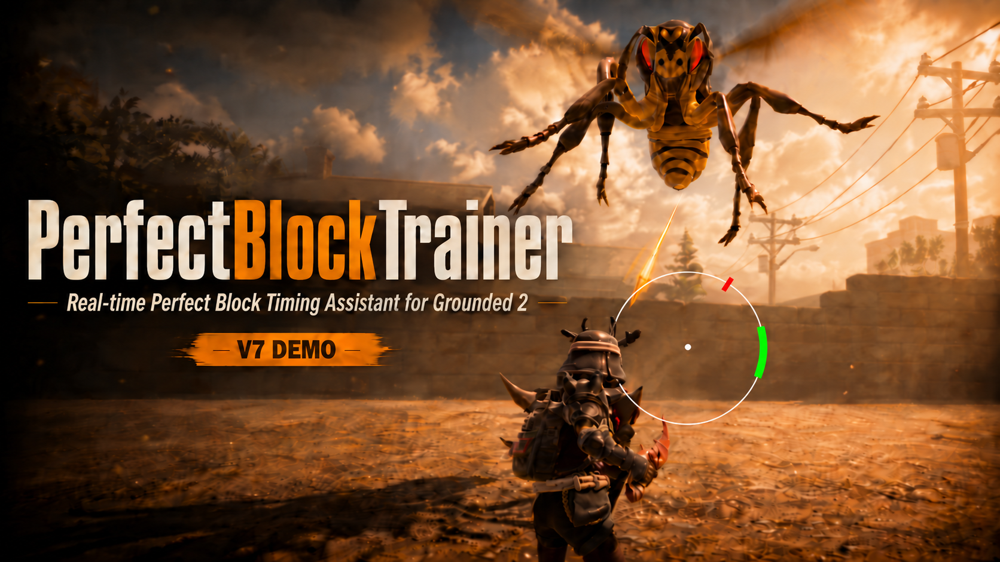
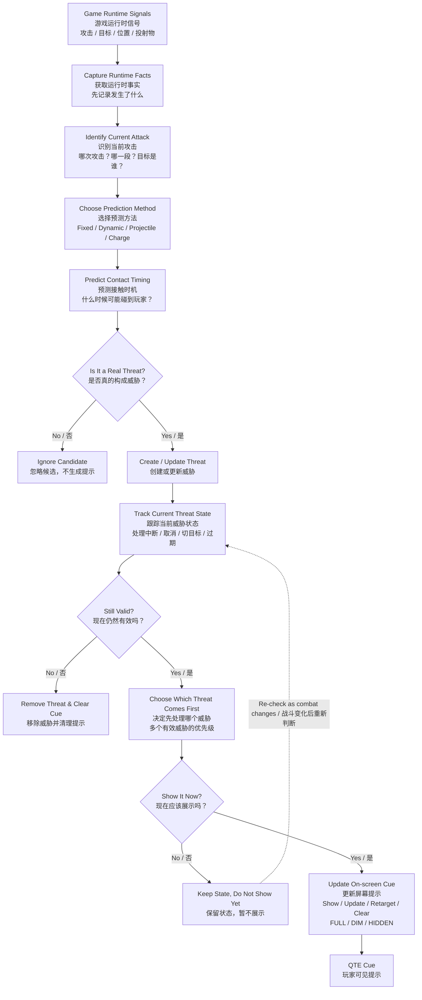

<p align="center">
  
</p>

<h1 align="center">PerfectBlockTrainer</h1>

<p align="center">
  <b>Real-time Combat Training & Threat Decision System for Grounded 2</b>
</p>

<p align="center">
  Turns hidden combat timing into observable, real-time player feedback without automating player input.<br>
  将隐藏的战斗时序转化为可观察的实时反馈，同时保留玩家自己的判断与操作。
</p>

<p align="center">
  <a href="https://github.com/Dio23366/PerfectBlockTrainer-Releases/releases"><b>GitHub Releases</b></a>
  &nbsp;•&nbsp;
  <a href="https://www.nexusmods.com/grounded2/mods/198"><b>Nexus Mods</b></a>
  &nbsp;•&nbsp;
  <a href="https://www.bilibili.com/video/BV1wh8R6iESi/"><b>Gameplay Demo</b></a>
  &nbsp;•&nbsp;
  <a href="INSTALL.md"><b>Installation Guide</b></a>
</p>

---

## Product Overview / 产品概述

**PerfectBlockTrainer** started from a simple player problem: in complex combat, the timing behind Perfect Block opportunities is difficult to observe, understand, and practice reliably.

Instead of automating combat, the product converts hidden runtime timing into player-facing decision support:

```text
System predicts
→ UI explains
→ Player decides
→ Game validates
```

A fixed countdown is not enough once combat includes multi-hit attacks, charge / moving-body attacks, projectiles, multiple simultaneous threats, target changes, interrupts, cancellations, and different blockable / unblockable semantics. The system therefore evolved into a stateful real-time decision system that continuously decides **what an observed event means, whether it still constitutes a valid threat, and whether that threat should be shown to the player now**.

**中文说明**

PerfectBlockTrainer 从一个真实玩家问题出发：复杂战斗中的完美格挡时序原本隐藏在动画和 Runtime 中，玩家很难稳定观察、理解和练习。

它不替玩家自动格挡，而是负责预测和解释，让玩家自己判断与操作，再由游戏结果验证。随着多段攻击、冲刺、投射物、多敌人、目标切换、攻击取消等情况出现，系统真正需要解决的也不再只是“倒计时”，而是持续判断：**发生了什么、它意味着什么、是否仍然构成威胁，以及当前是否值得展示。**

### Public release & usage / 公开发布与使用情况

- **Stable Public Release:** V7.0.7
- **441 Unique Downloads** on Nexus Mods
- **657 Total Downloads** on Nexus Mods
- **2,971 Nexus Views**
- **7 Endorsements**
- **10,000+ cumulative views** across public Bilibili videos
- **7 public iteration rounds** after the initial V7.0 release
- Real-user feedback covering performance, compatibility, installation, attack coverage, multiplayer behavior, and UX

> Nexus download and view counts reflect public distribution and discovery activity. They are not treated as DAU, retention, or active-user metrics.
>
> Nexus 的下载与浏览数据只作为公开发布和 Adoption 信号使用，不等同于 DAU、留存或活跃用户指标。

---

## Runtime Decision Flow / 实时决策流程

This diagram intentionally shows the **production runtime path** only. Development probes, release hardening, and later validation evidence are not expanded into the main architecture, because they belong to engineering verification rather than the player-facing runtime decision chain.

> 这张图只描述 **PBT 正式运行时的核心决策路径**。开发 Probe、发布硬化和后续验证证据不会展开进主架构图，因为它们属于工程验证，而不是玩家实际看到的 Runtime 主链路。


```mermaid
flowchart TD
    A["Game Runtime Signals<br/>游戏运行时信号<br/>攻击 / 目标 / 位置 / 投射物"] --> B["Capture Runtime Facts<br/>获取运行时事实<br/>先记录发生了什么"]
    B --> C["Identify Current Attack<br/>识别当前攻击<br/>哪次攻击？哪一段？目标是谁？"]
    C --> D["Choose Prediction Method<br/>选择预测方法<br/>Fixed / Dynamic / Projectile / Charge"]
    D --> E["Predict Contact Timing<br/>预测接触时机<br/>什么时候可能碰到玩家？"]

    E --> F{"Is It a Real Threat?<br/>是否真的构成威胁？"}
    F -- "No / 否" --> F0["Ignore Candidate<br/>忽略候选，不生成提示"]
    F -- "Yes / 是" --> G["Create / Update Threat<br/>创建或更新威胁"]

    G --> H["Track Current Threat State<br/>跟踪当前威胁状态<br/>处理中断 / 取消 / 切目标 / 过期"]
    H --> I{"Still Valid?<br/>现在仍然有效吗？"}
    I -- "No / 否" --> I0["Remove Threat & Clear Cue<br/>移除威胁并清理提示"]
    I -- "Yes / 是" --> J["Choose Which Threat Comes First<br/>决定先处理哪个威胁<br/>多个有效威胁的优先级"]

    J --> K{"Show It Now?<br/>现在应该展示吗？"}
    K -- "No / 否" --> K0["Keep State, Do Not Show Yet<br/>保留状态，暂不展示"]
    K0 -. "Re-check as combat changes / 战斗变化后重新判断" .-> H
    K -- "Yes / 是" --> L["Update On-screen Cue<br/>更新屏幕提示<br/>Show / Update / Retarget / Clear<br/>FULL / DIM / HIDDEN"]
    L --> M["QTE Cue<br/>玩家可见提示"]
```

The architecture remains deliberately compact: **observe → identify → choose a prediction path → predict contact → validate the threat → track its lifecycle → resolve priority → decide whether to display it**.

V7.0.7 does not replace this architecture. It strengthens several stages inside the same runtime model:

- **Prediction selection and contact timing** now cover more dynamic charge, relative-motion, projectile, FixedContact, and boss-specific cases.
- **Threat-state tracking** continues to remove stale or invalid cues when attacks are interrupted, cancelled, retargeted, missed, or expired.
- **Display control** now includes the player-facing `FULL → DIM → HIDDEN → FULL` visibility cycle.

**中文理解**

V7.0.7 并没有把 PBT 重构成另一套系统，而是在原有架构里继续增强预测、威胁状态和显示控制：

- 先从游戏 Runtime 中获取事实；
- 识别当前到底是哪一次攻击；
- 根据攻击类型选择合适的预测方法；
- 预测可能的接触时机；
- 判断它是否真的构成当前玩家威胁；
- 持续跟踪攻击是否被打断、取消、切目标或过期；
- 多个威胁同时成立时决定优先级；
- 最后再决定是否更新玩家屏幕上的 QTE。

这也是 V7.0.6 到 V7.0.7 的真实演进方式：**核心架构保持稳定，能力在内部逐步增强。**

---

## Key Runtime Concepts / 核心运行概念

The README uses action-oriented names first. The original technical terms are kept in parentheses where they are useful for implementation discussions.

> 为了让第一次接触项目的人直接看懂，这里优先使用“这一层具体在做什么”的名称；需要讨论实现时，再保留原来的技术术语作为括号说明。

| What this stage does / 这一层在做什么 | Meaning in PerfectBlockTrainer / 在 PBT 中的实际含义 |
|---|---|
| **Capture Runtime Facts / 获取运行时事实** *(Runtime Observation)* | Record raw facts from the running game：攻击事件、来源与目标、位置、速度、投射物状态等。这里只回答“发生了什么”，暂不解释它意味着什么。 |
| **Identify Current Attack / 识别当前攻击** *(Semantic Reconstruction)* | Turn raw callbacks into an understandable attack identity：判断这是哪一个敌人、哪一次攻击、哪一段连击、是否可格挡、当前目标是谁。 |
| **Choose Prediction Method / 选择预测方法** *(Collision Topology / Routing)* | Different physical attack types need different prediction methods：固定接触、移动本体/冲刺、直线投射物、弹道投射物分别进入合适的预测路径。 |
| **Predict Contact Timing / 预测接触时机** *(Prediction)* | Estimate when a candidate attack may contact the player：根据对应的运动/攻击模型估计可能接触时间，并允许运行时持续修正。 |
| **Is It a Real Threat? / 是否真的构成威胁** *(Threat Admission)* | Decide whether a prediction is actually relevant to the current player：即使能算出时间，也要确认攻击来源、目标关系、攻击状态和物理关系仍然成立。 |
| **Track Current Threat State / 跟踪当前威胁状态** *(Lifecycle / Authority)* | Keep only current, legitimate threat state：处理打断、击晕、击杀、取消、切目标、Miss、过期，并防止旧状态重新覆盖已经更新的威胁。 |
| **Choose Which Threat Comes First / 决定先处理哪个威胁** *(Arbitration)* | When several threats are valid at once, decide which ones deserve limited UI attention first：依据接触时间、优先级和稳定性规则选择展示顺序。 |
| **Update On-screen Cue / 更新屏幕提示** *(Scheduler / Display Control)* | Turn changing threat state into stable UI actions：决定什么时候显示、更新、切换、保持或清除提示，并在 V7.0.7 中支持 `FULL / DIM / HIDDEN` 显示状态。 |

Current production prediction families include:

```text
FIXED_SINGLE        — fixed single-hit timing / 固定单段攻击
FIXED_MULTI         — fixed multi-hit timing / 固定多段攻击
MOVING_BODY         — charge / moving attacker / 冲刺或移动本体攻击
LINEAR_PROJECTILE   — straight-line projectile / 直线投射物
BALLISTIC_PROJECTILE— arcing projectile / 弹道投射物
```

---

## Development Scope / 开发范围

PerfectBlockTrainer is independently designed, implemented, validated, released, and maintained as an end-to-end public project.

The project scope includes:

- Player problem discovery and product boundary definition
- Runtime decision-system architecture and interaction design
- AI-assisted implementation and iterative technical validation
- Runtime event capture, attack-meaning reconstruction, state transitions, and threat-validity tracking
- Release prioritization across compatibility, performance, attack coverage, reliability, and UX
- Real-user issue reproduction, root-cause analysis, and regression validation
- Runtime validation, release hardening, clean-install acceptance, and public packaging
- Release documentation, demos, and community feedback maintenance

Rather than being maintained as a one-off prototype, the project follows a continuous product loop:

```text
Player Problem
→ System Design
→ Implementation
→ Runtime Validation
→ Public Release
→ User Feedback
→ Iteration
```

**中文说明**

这个项目不是一次性 Demo。开发范围同时覆盖产品问题定义、系统设计、AI-assisted implementation、运行时验证、公开发布、用户反馈和后续迭代。

重点不只是“功能能不能跑”，而是产品在真实发布后能否被安装、理解、稳定使用，并在出现问题后形成可重复验证的修复闭环。

---

## Design Decisions Behind the Flow / 流程背后的设计判断

The architecture was **not** designed for complexity. Each separation exists because a simpler assumption failed in real runtime scenarios.

> 复杂度不是设计目标，而是问题复杂度留下来的结果。只有当更简单的假设在真实 Runtime 中失败时，才增加新的机制。

### 1. Raw Event ≠ Attack Meaning / 捕捉到事件 ≠ 已经理解攻击含义

A runtime callback tells the system that something happened, but not necessarily what the attack means.

Therefore the system reconstructs the attack meaning using information such as:

- Source — which enemy / attack source
- Montage — which animation / attack sequence
- AttackGeneration — which specific attack instance
- HitIndex — which hit inside a multi-hit sequence
- Cue semantics — blockable / unblockable / no cue
- Target relationship — who the attack is currently aimed at

**Design consequence:** raw game events are captured first; attack meaning is reconstructed only after enough context is available.

**中文理解**

游戏告诉系统“发生了一个事件”，不代表系统已经知道“这是哪一次攻击、哪一段连击、是否可格挡、属于哪个目标关系”。

因此系统先记录“发生了什么”，再通过 **Attack Meaning Reconstruction / 攻击含义还原** 判断“这是哪次攻击、哪一段、是否可格挡、当前目标是谁”。

---

### 2. Attack Started ≠ Still Threatening the Player / 攻击已经发动 ≠ 现在仍然威胁玩家

An enemy starting an attack does not mean the attack remains a valid player threat.

The attack may later be:

- Interrupted
- Stunned
- Cancelled
- Invalidated by death
- Retargeted
- Physically missed

**Design consequence:** the system explicitly tracks whether each threat is still valid, removes invalid threats, and controls which current state is allowed to update them.

**中文理解**

例如怪物已经发动攻击，但随后被打断、击晕、击杀，或者已经切换目标，那么原来的 QTE 就不能继续残留。

这就是 **Threat Validity Tracking / 威胁有效性跟踪**（技术上对应 Threat Lifecycle）存在的原因：系统持续判断威胁从创建、更新到失效、过期和清除的状态变化。

**State Update Ownership / 状态更新权**（技术上对应 Authority）解决另一类问题：旧攻击、旧预测、新目标和新的 Runtime Event 可能同时存在，系统必须明确“哪个状态现在还能更新这个威胁”，避免已经失效的旧状态重新覆盖新状态。

---

### 3. Predictable Contact ≠ Valid Threat / 能算出接触时间 ≠ 当前真的构成有效威胁

A contact time can be mathematically predicted while the candidate is still not a legitimate threat to the player.

**Design consequence:** contact-time prediction is separated from the valid-threat check, so a mathematically plausible result does not automatically become a player-facing prompt.

**中文理解**

“数学上能算出什么时候会碰到玩家”不代表这个候选攻击就应该进入正式 Threat 系统。

例如攻击来源已经失效、目标已经切换，或者当前攻击实例/物理关系已经不再成立，系统仍可能数学上算出一个时间值。因此 **Valid Threat Check / 有效威胁判定**（技术上对应 Threat Admission）会再确认：这个预测现在是否真的与玩家有关，只有通过后才进入后续流程。

---

### 4. Valid Threat ≠ Show It Now / 确实是威胁 ≠ 现在就一定要展示

Multiple valid threats can exist at the same time while player attention and visible UI capacity are limited.

**Design consequence:** when several threats are valid at once, the system first chooses priority, then controls when each cue should be shown, updated, retained, or cleared.

**中文理解**

多个 Threat 可以同时全部“合法”，但玩家注意力和 UI 槽位是有限的。

因此 **Multiple-Threat Priority Selection / 多威胁优先级选择**（技术上对应 Arbitration）先决定多个有效威胁中谁更应该占用有限 UI；随后 **Display Update Control / 提示显示与更新控制**（技术上对应 Scheduler）把持续变化的状态转换成稳定的显示、更新、切换和清理行为，避免 UI 因瞬时变化频繁抖动或残留。

---

### 5. System Recommendation ≠ Player Action / 系统给出提示 ≠ 替玩家完成操作

The system decides what information should be shown, but it does **not** perform the block for the player.

**Design consequence:**

```text
System predicts
→ UI explains
→ Player decides
→ Game validates
```

This preserves player agency and keeps the product in the category of training / decision support rather than combat automation.

**中文理解**

PBT 的边界是“系统负责预测和解释，玩家负责决策和操作”。即使系统判断某个时间点值得提示，也不会自动执行 Block。

这保证了产品仍然是训练和 Decision Support，而不是 Combat Automation。

---

## Performance Incident: QTE-active FPS Drop / 性能问题与修复

One representative post-release incident came from real user feedback.

A user reported that while the QTE pointer was active during enemy attacks, frame rate could drop from roughly **120 FPS to around 10 FPS**, then recover after the attack ended.

The response was not to broadly rewrite the rendering or prediction system.

```text
User symptom / 用户现象
↓
Clarify trigger boundary / 明确触发边界
↓
Reproduce / 复现
↓
Collect runtime evidence / 收集运行时证据
↓
Find first responsible layer / 找到最早出错层
↓
Root cause / 根因
repeated Widget rediscovery while the QTE Pointer was active
QTE Pointer 激活期间重复查找 Widget
↓
Minimum fix / 最小修复
cache the valid Widget reference
缓存有效 Widget 引用
↓
Regression validation / 回归验证
↓
Public V7.0.2 release / 发布 V7.0.2
↓
User re-confirmed the FPS drop was gone
用户再次确认掉帧问题消失
```

This incident established a debugging and release principle used throughout later development:

> **User feedback is a symptom, not automatically a requirement. Reproduce first, locate the earliest wrong layer, apply the minimum responsible fix, then run regression.**
>
> **用户反馈首先是 Symptom，而不是自动变成 Requirement。先复现，再定位最早错误层，只修改最小责任范围，最后通过 Regression 确认修复没有破坏其他正常 Case。**

The fix was then retained as a regression case so later changes could be checked against the same failure pattern rather than relying on one-time confirmation.

---

## Product Evolution / 产品演进

PerfectBlockTrainer did not move through versions by adding features at random. Priorities changed with product maturity.

```text
V7.0.0
First public release / 首次公开发布
↓
V7.0.1
Compatibility / availability
兼容性与可用性
↓
V7.0.2
Severe performance badcase fix
严重性能 Badcase 修复
↓
V7.0.3
Coverage / semantics / projectile capability
攻击覆盖、语义与投射物能力
↓
V7.0.4
Complex-combat reliability turning point
复杂战斗可靠性转折点
↓
V7.0.5
Target switching / stale-state cleanup / mixed-combat stability
目标切换、旧状态清理与混合战斗稳定性
↓
V7.0.6
Boss & variant coverage / readability / release hardening
Boss 与变体覆盖、可读性、发布硬化
↓
V7.0.7
Roster coverage / second-layer dynamic prediction / QTE visibility control
生物覆盖、二层动态预测与 QTE 显示控制
```

Release priorities evolved roughly as:

```text
Availability / 可用
→ Correctness / 正确
→ Reliability / 可靠
→ Coverage / 覆盖
→ UX & Readability / 可读与易用
→ Release Quality / 发布质量
```

V7.0.7 represents a later product stage: the core system is already stable enough that development can expand coverage, improve dynamic prediction, and add user-facing display controls without abandoning the established reliability and release gates.

**中文说明**

版本优先级不是固定的。早期首先解决“能不能正常使用”，随后才逐渐转向正确性、复杂场景稳定性、覆盖、UX 和 Release Quality。

到了 V7.0.7，开发重点已经从单纯修复基础可用性，进一步转向当前生物覆盖、复杂动态攻击预测以及玩家可控的 QTE 显示体验，同时继续保持已有的回归与发布质量要求。

Detailed per-version feature changes and player-facing patch information are maintained through **Nexus Mods** and **GitHub Releases** rather than duplicated here.

---

## Reliability & Release Engineering / 可靠性与发布

V7.0.7 completed a dedicated public-runtime and distribution-level acceptance process before release.

Representative accepted scenarios include:

- Garden Masked Fighter / Mysterious Stranger attack coverage — **PASS**
- O.R.C. Broodmother representative attacks — **PASS**
- O.R.C. Broodmother Slow 5-Combo — **PASS**
- O.R.C. Broodmother Fast 5-Combo — **PASS**
- O.R.C. Broodmother Fast 3-Combo — **PASS**
- Dynamic charge / moving-body prediction — **PASS**
- Representative projectile and relative-motion prediction — **PASS**
- F8 QTE visibility cycling: `FULL → DIM → HIDDEN → FULL` — **PASS**
- Release-package clean-install game test — **PASS**
- Fresh public runtime smoke test — **PASS**
- Runtime restored after release validation — **PASS**
- Fatal error during accepted final release testing — **NO**

The current release also completed the intended QTE adaptation pass for the known creature roster in the tested Grounded 2 version. This does **not** mean every animation should produce a blockable QTE: `NO_CUE`, attacks that are not handled as ordinary Perfect Block attacks, and explicitly deferred special cases remain intentional exceptions.

**中文说明**

V7.0.7 的“覆盖完成”指当前已知生物范围内的 QTE 适配主线已经完成，并通过代表性实战验证；它不表示游戏中的每一个动画都必须显示可格挡 QTE。`NO_CUE`、非普通格挡攻击以及明确延期处理的特殊攻击仍属于设计例外。

### Public Release Hardening / 公开版本硬化

The public DLL is built using a dedicated `PUBLIC_RELEASE_HARDENED` configuration.

Development-only surfaces such as detailed diagnostics, runtime probes, development logging, and development-path exposure are removed while preserving accepted gameplay behavior.

**中文说明**

开发环境需要 Probe、详细日志和诊断能力，但玩家版本不应该携带这些开发暴露面。因此 Public Build 会在保留已验收 Gameplay 行为的前提下，移除仅用于开发的诊断、路径和日志信息。

### Clean-install Validation / 全新安装验证

The final public release package itself was used for player-style clean-install testing.

The process intentionally avoided relying on development build artifacts, so the accepted release package and the package distributed to players are the same release unit.

**中文说明**

最终验证使用的就是玩家实际下载到的 Release Package，而不是开发机上额外存在的文件。这样可以避免“开发环境能跑，但正式包缺文件”的发布问题。

---

## Product Boundary / 产品边界

PerfectBlockTrainer is designed for:

- Combat training / 战斗训练
- Timing visualization / 时序可视化
- Attack prediction / 攻击预测
- Threat warnings / 威胁提示
- Perfect Block practice / 完美格挡练习

PerfectBlockTrainer does **not** provide:

- Automatic blocking / 自动格挡
- Automatic dodging / 自动闪避
- Automatic player input / 自动玩家输入
- Damage modification / 伤害修改
- Inventory modification / 背包修改
- Save manipulation / 存档修改
- Network manipulation / 网络修改
- Remote-player manipulation / 远端玩家操控
- Anti-detection or bypass functionality / 反检测或绕过功能

**The player always performs the actual combat input. / 最终战斗操作始终由玩家本人完成。**

---

## Current Public Capabilities / 当前公开能力

PerfectBlockTrainer currently supports multiple production prediction and presentation paths:

- Fixed single-hit attacks / 固定单段攻击
- Fixed multi-hit attacks / 固定多段攻击
- Multiple simultaneous threats / 多威胁同时预测
- Moving-body / charge attacks / 冲刺与移动本体攻击
- Linear projectile attacks / 直线投射物
- Ballistic projectile attacks / 弹道投射物
- Blockable / unblockable attack classification / 可格挡与不可格挡攻击分类
- Multi-phase attack handling / 多阶段攻击
- Runtime prediction correction / 运行时预测修正
- **Second-layer dynamic prediction for relative movement / 基于相对运动的二层动态预测**
- Threat target update / 威胁目标变化后的更新
- Automatic cleanup when attacks stop being valid threats / 攻击不再构成威胁时自动清理提示
- Chronological handling of upcoming multi-hit threats / 多段威胁按接触顺序处理
- Save / map transition cleanup / 存档与地图切换时的状态清理
- QTE Ring / Pointer cleanup / QTE Ring 与 Pointer 清理
- **QTE visibility control: `FULL → DIM → HIDDEN → FULL` / QTE 显示状态切换**

Representative current production coverage includes:

- Multi-enemy and mixed-threat combat
- Mixed melee and ranged combat
- Multi-hit and special attack sequences
- Garden Masked Fighter / Mysterious Stranger boss attacks
- O.R.C. Broodmother multi-phase combo attacks
- Lizard boss representative attack routes
- ToeBiter family validated routes, including key OGRE / Leviathan variants
- AXL representative attack routes
- TayzT / RuzT / SphereBot combo coverage
- Cockroach Queen / Berserker General Headless Spray timing
- Black Ant direct-contact projectiles
- Earwig RockThrow during mixed combat
- Representative dynamic prediction cases involving Mosquito, Blue Butterfly, Bee, Wasp, Ladybug, and rolling / charge-style enemies
- Multiple simultaneous threats
- Blockable / unblockable warning behavior

> Detailed creature- and attack-level patch information is maintained on Nexus Mods and GitHub Releases.
>
> 具体怪物、攻击路线和版本级 Patch 信息主要维护在 Nexus Mods 与 GitHub Releases；本 README 更关注产品工作方式和系统能力。

---

## Visual Semantics / 提示语义

PerfectBlockTrainer uses different visual cues depending on attack semantics:

- **Green QTE / 绿色 QTE** — Perfect Block opportunity / 存在 Perfect Block 时机
- **GOLD overlap / 金色重叠区** — shared overlap area of two blockable green Perfect Block windows / 两个独立可格挡窗口的公共重叠区域
- **Red warning / 红色警告** — Unblockable attack / dodge warning / 不可格挡攻击或闪避警告
- **No cue / 不显示提示** — attacks that should not produce a Perfect Block prompt / 不应产生 Perfect Block QTE 的攻击

Red does **not** mean "hard attack" or "high damage". It specifically means **this attack cannot be Perfect Blocked and should be treated as a dodge / danger warning** in the current product rules.

The GOLD overlap is a readability feature only. It does not change attack timing, Perfect Block window size, or Grounded 2 combat rules.

V7.0.7 also adds player-controlled QTE visibility modes through **F8**:

```text
FULL → DIM → HIDDEN → FULL
```

This changes presentation only. Prediction and combat-state tracking continue to run while the UI is dimmed or hidden.

---

## Demo / 演示

### Gameplay Demo / 功能演示

▶ **[Watch the PerfectBlockTrainer Gameplay Demo on Bilibili](https://www.bilibili.com/video/BV1wh8R6iESi/)**

The long-term gameplay demo is maintained as the product evolves. Current showcase topics include:

- Multi-enemy mixed combat
- Real-time projectile tracking
- Dynamic projectile contact prediction
- Boss attack compatibility
- Unblockable attack warnings
- Dynamic charge attack prediction
- Multi-threat QTE readability
- QTE visibility control: `FULL · DIM · HIDDEN`

### Installation Video / 安装视频

▶ **[PerfectBlockTrainer Complete Installation Guide](https://www.bilibili.com/video/BV1ws4R6fEYL/)**

The installation video was originally recorded for an earlier V7 release, but the core installation flow remains applicable to V7.0.7 when using **UE4SS_Grounded2 1.0.4**.

---

## Requirements / 依赖

PerfectBlockTrainer V7.0.7 requires:

1. **Grounded 2**
2. **UE4SS_Grounded2 1.0.4**

Required entries in `mods.txt`:

```text
BPML_GenericFunctions : 1
BPModLoaderMod : 1
PerfectBlockTrainerCpp : 1
```

No additional gameplay mod is required.

`BPML_GenericFunctions` and `BPModLoaderMod` are part of the supported UE4SS_Grounded2 setup and support Blueprint UI creation, update, and cleanup.

---

## Installation / 安装

Download the current release from:

- **[Nexus Mods — PerfectBlockTrainer](https://www.nexusmods.com/grounded2/mods/198)**
- **[GitHub Releases — PerfectBlockTrainer](https://github.com/Dio23366/PerfectBlockTrainer-Releases/releases)**

Then follow:

**[INSTALL.md](INSTALL.md)**

Current release package:

```text
PerfectBlockTrainer_V7.0.7_RELEASE.zip
```

Package structure:

```text
PerfectBlockTrainer_V7.0.7_RELEASE/
├─ Mods/
│  └─ PerfectBlockTrainerCpp/
│     └─ dlls/
│        └─ main.dll
│
├─ LogicMods/
│  ├─ PerfectBlockTrainer.pak
│  ├─ PerfectBlockTrainer.ucas
│  └─ PerfectBlockTrainer.utoc
│
├─ INSTALL.txt
├─ VERSION.txt
├─ RELEASE_NOTES.md
└─ RELEASE_MANIFEST_SHA256.tsv
```

Validated installation flow:

```text
Install UE4SS_Grounded2 1.0.4
↓
Launch Grounded 2 once to verify UE4SS
↓
Install PerfectBlockTrainerCpp
↓
Install all three PerfectBlockTrainer LogicMods files
↓
Enable PerfectBlockTrainerCpp in mods.txt
↓
Launch Grounded 2
↓
Enter a save
↓
Test Ring / Pointer / QTE
```

---

## Known Limitations / 当前限制

V7.0.7 completed the current known-creature QTE adaptation pass for the tested Grounded 2 version, but the product still keeps explicit behavior boundaries.

Current limitations include:

- `NO_CUE` attacks intentionally do not produce a normal Perfect Block prompt
- Attacks that are not treated as ordinary blockable attacks may use warning behavior or no QTE
- Explicitly deferred special attacks may still require dedicated runtime validation
- Different attacks from the same enemy can use different prediction paths and semantics
- Multiplayer validation remains primarily **host-side**; full guest/client QTE support is not yet implemented
- Future Grounded 2 updates may change runtime behavior or hooks and may require compatibility fixes
- PerfectBlockTrainer is a training / visualization product and does not change the game's actual Perfect Block rules

**中文说明**

V7.0.7 已完成当前测试版本已知生物范围内的 QTE 适配主线，但这不等于“每一个动画都应该出现绿色 QTE”。

`NO_CUE`、非普通格挡攻击、明确延期处理的特殊攻击，以及尚未完成的多人客机 QTE，都属于当前明确的产品边界。

If an attack produces no QTE where one is expected, incorrect timing, or the wrong semantic warning, please report the specific enemy and attack.

---

## Community Testing / 社区测试

Community feedback is an important part of expanding attack coverage and validating regressions.

When reporting a problem, please include as much of the following as possible:

```text
Enemy / Creature
Attack / Move name if known
Single / Combo / Charge / Projectile
Blockable / Unblockable if known
Expected behavior
Actual behavior
Missing / Early / Late / Incorrect QTE
Game version
PerfectBlockTrainer version
UE4SS version
Video / GIF if possible
```

If an issue can be reproduced consistently but cannot be reproduced during development, `UE4SS.log` may also be useful.

Recommended issue categories:

```text
BUG
ATTACK MISSING
TIMING WRONG
FALSE QTE
UNBLOCKABLE WARNING
PROJECTILE
UI
PERFORMANCE
COMPATIBILITY
```

Different attacks from the same creature are useful to report separately.

---

## Release Integrity / 发布校验

Only packages distributed through the official PerfectBlockTrainer channels should be considered official builds.

### PerfectBlockTrainer V7.0.7 Release ZIP

```text
PerfectBlockTrainer_V7.0.7_RELEASE.zip

SHA256
1822BFF8A389EBD14BF11AAD287710FE96C68383AFC9FEA0291AA6A981E8A4E9
```

### PerfectBlockTrainer V7.0.7 Runtime DLL

```text
main.dll

SHA256
64236917A2B0805321EA50DCA6167177FB039ECBE57FC0764E15B08E58215D95
```

Modified or redistributed builds with different identities should be treated as **unofficial builds**.

The release ZIP SHA256 is the package-level identity. The release package also contains `RELEASE_MANIFEST_SHA256.tsv` for its packaged file manifest.

See [`SHA256SUMS.txt`](SHA256SUMS.txt) for the public release hash list.

---

## Repository Scope / 仓库说明

This repository is the public technical and distribution home of PerfectBlockTrainer.

The public surfaces are intentionally separated by purpose:

- **GitHub README** — product concept, system architecture, development evolution, validation, and release process
- **Nexus Mods** — player-facing release information, current downloads, version-specific changes, compatibility, and community distribution
- **GitHub Releases / INSTALL.md** — release packages and installation guidance

**中文说明**

不同页面承担不同职责：GitHub README 主要说明产品本身如何工作、为什么这样设计以及如何演进；Nexus 更适合维护玩家真正关心的版本更新、兼容性、下载和具体 Patch；GitHub Releases 与 INSTALL.md 则负责正式安装包和安装说明。

这样可以避免 README 变成重复的 Patch Notes，同时让产品结构保持相对稳定。

Public repository content includes:

- Product and architecture documentation
- Release documentation
- Installation documentation
- Media / demos
- Public release hashes
- Official binary release packages

Development source code, internal runtime evidence, development probes, build artifacts, backups, and Formal Freeze archives are maintained separately and are **not distributed through this repository**.

---

## Public Links / 公开页面

- **Nexus Mods:** [PerfectBlockTrainer](https://www.nexusmods.com/grounded2/mods/198)
- **GitHub Public Repository:** [PerfectBlockTrainer-Releases](https://github.com/Dio23366/PerfectBlockTrainer-Releases)
- **GitHub Releases:** [PerfectBlockTrainer Releases](https://github.com/Dio23366/PerfectBlockTrainer-Releases/releases)
- **Gameplay Demo:** [BV1wh8R6iESi](https://www.bilibili.com/video/BV1wh8R6iESi/)
- **Installation Video:** [BV1ws4R6fEYL](https://www.bilibili.com/video/BV1ws4R6fEYL/)
- **Bilibili Creator Page:** [bili_55415870362](https://space.bilibili.com/3546748811217856)

---

## Credits

Built for **Grounded 2** using **UE4SS**.

Thanks to the UE4SS / RE-UE4SS project and community for the modding framework.

Grounded 2 is developed by **Obsidian Entertainment** and published by **Xbox Game Studios**.

---

## Version / 当前版本

**V7.0.7 — Stable Public Release**

Current public runtime:

**UE4SS_Grounded2 1.0.4**

Previous public releases:

```text
V7.0.6 — Expanded Combat Coverage & Boss Timing Improvements
V7.0.5 — Combat Targeting & QTE Stability Improvements
V7.0.4 — Combat Reliability & Mixed-Threat Improvements
V7.0.3 — Semantic Prediction & Coverage Expansion
V7.0.2 — Performance Fix
V7.0.1 — UE4SS_Grounded2 1.0.4 Compatibility Update
V7.0   — First Public Release
```
